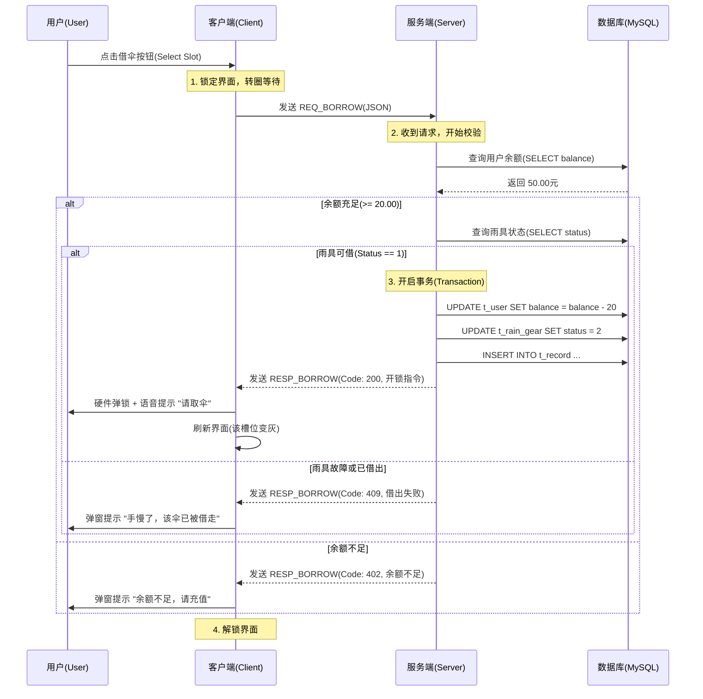
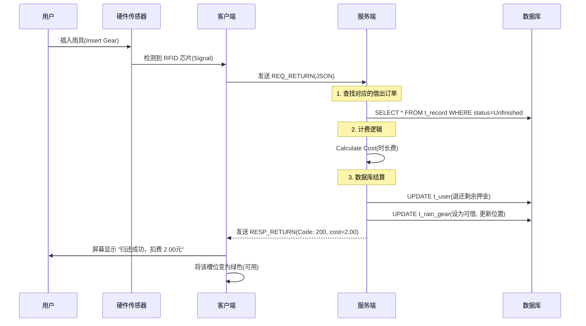

# 基于Qt的校园分布式自助雨具终端系统（架构）

## 1.项目简介

### 1.1 系统介绍 (System Introduction)

**RainHub 校园智能共享雨具终端系统** 是一款基于 **C++ 语言** 与 **Qt 框架** 开发的分布式物联网（IoT）模拟系统。本系统旨在更好地为高校校园内师生雨天出行提供服务，通过数字化手段实现雨具的无人值守与自助化服务。

系统采用经典的 **C/S（客户端/服务端）分布式架构** 设计：

* **服务端（Server）**：作为中央控制枢纽，负责处理多终端的高并发连接、用户信息鉴权、雨具库存调度以及持久化数据存储（SQLite）。
* **客户端（Client）**：部署于模拟终端设备，提供触控可视化交互界面，并通过软件逻辑模拟真实的硬件动作（如电磁锁扣的弹开与闭合、库存状态的实时变更）。

在技术实现上，本项目深度应用了 **面向对象编程（OOP）** 思想，对“雨伞”、“雨衣”等不同雨具进行了继承与多态设计；利用 **TCP Socket 网络编程** 技术，实现了终端与云端的毫秒级状态同步。系统不仅模拟了真实的商业级自助设备操作流程，还集成了在线客服、故障上报等辅助功能，是一套完整的校园物联网解决方案。

### 1.2系统模拟使用场景

<div align="center">
    
    <br>
    <div style="color:gray; font-size: 14px; padding: 10px;">
        图 1-1 RainHub 智能自助雨具终端外观设计图
    </div>
</div>


## 2. 系统总体架构设计 (System Architecture Design)

### 2.1 总体架构模式 (Overall Architecture)
本系统采用标准的 **C/S (Client/Server)** 分布式架构，将系统逻辑划分为“服务端”与“客户端”两部分，二者通过 TCP/IP 协议进行数据通信。

* **服务端 (Server Layer)**：作为系统的“大脑”，承担数据持久化、业务逻辑处理及多终端并发管理的职责。
* **客户端 (Client Layer)**：作为系统的“手脚”，运行于智能终端硬件上，负责用户交互 (UI)、硬件状态模拟及指令发送。
* **网络层 (Network Layer)**：基于 Qt Network 模块实现的 Socket 通信链路，确保指令传输的实时性与可靠性。

### 2.2 软件设计模式：MVC 分层设计
为了降低代码耦合度，提高系统的可维护性与扩展性，本系统在客户端与服务端的设计中均引入了 **MVC (Model-View-Controller)** 设计模式的思想：

1.  **模型层 (Model)**：
    * 负责数据的定义与存储。
    * *包含类*：`User` (用户类)、`RainGear` (雨具基类)、`Umbrella/Raincoat` (派生类)。
    * *职责*：仅保存数据状态（如雨伞是否损坏、用户余额多少），不包含任何界面逻辑。

2.  **视图层 (View)**：
    * 负责数据的可视化展示与用户交互。
    * *包含类*：`MainWindow` (主界面)、`LoginDialog` (登录窗口)、`ChatWidget` (客服聊天窗)。
    * *职责*：使用 Qt Designer 绘制，通过信号与槽 (Signal & Slot) 接收用户点击事件，并将操作反馈给控制层。

3.  **控制层 (Controller)**：
    * 负责业务逻辑的调度与网络通信。
    * *包含类*：`RainHubController` (核心业务控制器)、`NetworkManager` (网络管家)。
    * *职责*：接收视图层的指令（如“用户点击借伞”），处理业务逻辑（如“判断余额是否充足”），并通知模型层更新数据。

### 2.3 数据库设计策略 (Database Strategy)
为了保证数据的高可用性与多用户并发访问的稳定性，本系统服务端采用关系型数据库管理系统 **MySQL** 作为数据存储中心。

* **技术选型**：使用 Qt SQL 模块提供的 `QMYSQL` 驱动进行连接。相比于轻量级的 SQLite，MySQL 支持更细粒度的权限控制与事务处理，符合服务端集中式管理的设计要求。
* **DAO 模式封装**：
    * **DatabaseManager 类**：封装数据库连接池，读取配置文件中的 Host、Port、User、Password 等参数连接 MySQL 服务。
    * **数据隔离**：所有 SQL 操作（增删改查）均在服务端执行，客户端仅通过 TCP 网络协议请求数据，不直接接触数据库，确保了数据的安全性。


## 3. 系统详细设计 (Detailed Design)

### 3.1 客户端视图层设计 (View Layer Design)
本系统客户端界面基于 **Qt Widgets** 技术栈构建，采用 `QStackedWidget` 容器实现多页面间的平滑跳转。界面设计遵循“极简交互”原则，确保用户在 3 步之内即可完成核心业务操作。同时，为了提升用户体验（UX），系统引入了 **Qt Animation Framework** 实现动态 UI 效果。

* **全局导航设计**：除“初始引导页”外，所有子页面的左上角均固定设置一个 **[< 返回]** 按钮 (Back Button)。
* **功能**：点击该按钮可立即中断当前操作并返回上一级界面，符合物理操作直觉。

#### 3.1.1 启动与登录模块 (Startup & Login Module)
该模块包含四个连续跳转的子页面，负责引导用户进入系统并完成身份鉴权。

**1. 初始引导页 (WelcomePage)**
* **页面布局**：垂直居中布局 (`QVBoxLayout` + `Qt::AlignCenter`)。
* **视觉元素**：
    * **主标题**：屏幕中上部显示 **“NUIST智能自助雨具系统”**，采用大字号加粗字体。
    * **副标题**：主标题下方显示 **“欢迎您的使用”**，字号稍小，起到亲切引导作用。
    * **操作入口**：页面底部设置 **[开始使用]** 按钮。
* **交互逻辑**：点击按钮触发信号，跳转至“身份选择页”。

**2. 身份验证选择页 (IdentityPage)**
* **页面布局**：整体居中。
* **视觉元素**：
    * **提示语**：页面中央显示 **“您的身份是？”**。
    * **选择区**：下方并排设置两个大尺寸按钮 —— **[教职人员]** 与 **[学生]**。
* **交互逻辑**：点击任一按钮，系统将临时记录当前用户角色（Role），并根据选择跳转至同一模板但标签不同的“登录页”。

**3. 用户登录页 (LoginPage)**
* **页面布局**：表单式布局 (`QFormLayout`)，整体居中显示。
* **视觉元素**：
    * **账号输入**：
        * **标签**：根据上一页的选择动态显示 “请输入您的学号：” 或 “请输入您的工号：”。
        * **输入框**：右侧跟随一个 `QLineEdit` 输入框。
    * **密码输入**：
        * **标签**：显示 “密码：”。
        * **输入框**：设置为密文模式 (`EchoMode::Password`)，默认验证逻辑基于初始密码 `123456`。
    * **辅助功能**：输入框组的右下角设置一个纯文本风格的小按钮 **[修改密码]**。
* **交互逻辑**：
    * 点击 **[登录]**：提交账号密码至控制层校验，成功则进入主系统，失败弹出提示。
    * 点击 **[修改密码]**：跳转至“重置密码页”。

**4. 密码重置页 (ResetPwdPage)**
* **页面布局**：垂直列表布局，强调简洁性。
* **视觉元素**：
    * **页面标题**：顶部居中显示 “重置密码” 四个字。
    * **输入控件**：采用 **占位符文本 (PlaceholderText)** 设计，文字直接显示在输入框内部，不额外设置左侧标签。
        * **输入框 A**：内部灰色文字提示 “默认密码”（用于验证旧密码）。
        * **输入框 B**：内部灰色文字提示 “确认密码”（用于输入新密码）。
* **交互逻辑**：校验通过后更新数据库中的密码字段，并自动返回登录页。

#### 3.1.2 主功能菜单模块 (Main Dashboard Module)
用户登录成功后进入的核心导航界面，该页面强调动态交互与信息聚合。

**1. 页面布局与动效 (Layout & Animation)**
* **顶部栏**：居中显示系统名称 **“NUIST智能雨具系统”**，字体醒目。
* **中央交互区（动态核心）**：
    * **借还入口**：包含两个超大尺寸的圆形或圆角矩形按钮 —— **[我要借伞]** 与 **[我要还伞]**，中间通过艺术字 **“OR”** 连接。
    * **入场动画**：利用 `QPropertyAnimation` 实现“底部滑入”效果。当页面加载时，这两个核心按钮会从屏幕底部边缘平滑升起至屏幕中央，增加科技感与动感。
    * **说明入口**：在借还按钮下方，设置 **[使用说明]** 文本按钮，点击跳转至说明页。
* **底部功能区**：采用两端对齐布局，放置两个 **椭圆形 (Capsule Shape)** 按钮，使用 Qt Style Sheets (`border-radius`) 实现圆润视觉。
    * 左下角：**[👤 个人中心]** 按钮。
    * 右下角：**[🗺️ 查看地图]** 按钮。

**2. 交互逻辑**
* 点击 **[借] / [还]**：跳转至对应的雨具槽位选择界面（即硬件模拟界面）。
* 点击 **[个人中心]**：跳转至用户信息页。
* 点击 **[查看地图]**：跳转至校园网点地图页。

#### 3.1.3 辅助功能子页面 (Sub-Feature Pages)
本节描述主菜单下属的三个辅助功能模块，分别承担用户状态展示、规则说明及地理信息可视化功能。

**1. 个人信息页 (UserProfilePage)**

* **数据来源**：系统根据登录时绑定的校园卡/职工卡 ID，通过 `UserDAO` 从数据库动态加载。
* **UI 构成**：
    * **顶部区域**：显示用户头像（根据 Role 字段加载默认的学生或教师头像）。
    * **核心数据区**：采用四行垂直排列的大字体展示：
        1.  **标题**：“个人信息” (Font: Bold, 24pt)。
        2.  **姓名**：“张三” （对应数据库字段 `name`）。
        3.  **ID**：“学号：2023xxxx” （对应数据库字段 `uid`）。
        4.  **资产**：“账户余额：￥50.00” （对应数据库字段 `balance`）。
* **交互细节**：若余额低于 20.00元，字体颜色自动切换为红色 (`#e74c3c`) 以示预警。
* **交互逻辑**：底部设有 **[刷新余额]** 按钮，点击后发送查询请求，模拟从一卡通中心同步最新数据的过程。

**2. 使用说明页 (InstructionPage)**

* **对应类名**：`HelpWidget`
* **UI 构成**：
    * **内容区**：中央为一个大面积的 `QTextBrowser`（只读文本框）。
    * **操作区**：底部为 **[我已阅读]** 按钮，点击返回主菜单。
* **文本内容 (HTML 格式)**：为了保证排版美观（标题加粗、重点高亮），请使用以下 HTML 代码填充文本框：

```html
<h2 align="center">NUIST 智能雨具系统服务协议</h2>
<hr>

<h3>一、 服务对象</h3>
<p>本系统仅面向 NUIST 在校教职工与学生开放，登录需验证校园一卡通账户。</p>

<h3>二、 借还规则</h3>
<p><b>1. 借出：</b>账户余额需大于 <b>20.00元</b> 方可使用。借出时系统将冻结相应金额作为押金。</p>
<p><b>2. 归还：</b>请将雨具插入任意站点的空闲卡槽，听到“咔哒”上锁声并看到屏幕提示“归还成功”后方可离开。</p>

<h3>三、 资费标准 (自动扣款)</h3>
<ul>
    <li><b>普通雨伞/一次性雨衣：</b> 押金 20元。</li>
    <li><b>高级抗风伞/加厚雨衣：</b> 押金 50元。</li>
    <li><b>免费时长：</b> 借出后 <b>24小时内</b> 归还免费。</li>
    <li><b>超时费用：</b> 超过24小时，按 <b>1元/12小时</b> 从余额扣除，直至扣完押金。</li>
</ul>

<h3>四、 遗失与损坏</h3>
<p>若雨具遗失或严重损坏导致无法归还，系统将<b>扣除全额押金</b>用于赔偿。</p>

<h3>五、 联系我们</h3>
<p>如遇设备故障或扣费异常，请点击主页左侧的<b>【联系客服】</b>按钮，或致电校园服务中心：8888-1234。</p>
```

#### 3.1.4 借还业务交互页 (Borrow/Return Interface)
本页面为系统的核心业务窗口，旨在通过软件界面模拟真实的硬件柜门状态。设计重点在于利用 Qt 的自定义控件技术，直观地展示“多态雨具”的库存情况与卡槽状态。

* **页面布局策略**：采用 **Grid Layout (网格布局)** 模拟物理机柜的矩阵排列（标准设计为 3行 x 4列，共 12 个物理槽位）。

**1. 核心控件：自定义槽位单元 (SlotItem Widget)**
为了实现高度定制化的视觉效果，不使用标准的 `QPushButton`，而是继承 `QWidget` 封装一个自定义控件类 `SlotItem`。

* **视觉构成**：
    * **背景容器**：圆角矩形卡片，颜色根据状态动态变化。
    * **中央图标**：根据 `RainGear` 对象的具体类型（OOP多态），加载不同资源图片：
        * `StandardUmbrella`（普通伞）：显示 ☔️ 黑色简约伞图标。
        * `PremiumUmbrella`（高级伞）：显示 ☂️ 金色/双层伞图标（以此体现继承类的差异）。
        * `Raincoat`（雨衣）：显示 🧥 折叠雨衣图标。
    * **编号标签**：左上角显示槽位物理编号（如 `#01`, `#02`）。
    * **价格/类型标签**：底部小字显示具体品类名称（如“抗风伞”）。
* **状态与颜色映射 (State-Color Mapping)**：
    系统通过 CSS 样式表 (`setStyleSheet`) 动态切换背景色以反映硬件状态：
    * 🟢 **可借状态 (Available)**：背景色 `#2ecc71` (绿色)。表示槽位内有雨具，且锁扣已闭合。
    * ⚪️ **可还状态 (Empty)**：背景色 `#bdc3c7` (灰色)。表示槽位为空，等待用户插入雨具。
    * 🔴 **故障/维护 (Maintenance)**：背景色 `#e74c3c` (红色)。表示硬件报错，禁止交互。
    * 🟡 **选中状态 (Selected)**：背景色 `#f1c40f` (黄色)。用户点击后的高亮反馈。

**2. 交互逻辑设计 (Interaction Logic)**

* **场景 A：借雨具模式 (Borrow Mode)**
    1.  **初始化**：页面加载时，遍历服务端返回的库存列表。仅将状态为 **“可借 (Available)”** 的槽位设为激活（Enabled），其余槽位变灰或锁定。
    2.  **用户操作**：
        * 用户点击某个 **绿色槽位**。
        * 弹出 **“确认借出”** 模态对话框，显示该雨具的详细属性（类型、押金金额）。
        * 点击确认后，发送 `REQ:BORROW` 指令至服务端。
    3.  **硬件模拟反馈**：
        * 界面收到服务端 `RESP:SUCCESS` 信号。
        * **动画效果**：该槽位的锁扣图标从“🔒”变为“🔓”，随后图标淡出（Fade Out），背景变为灰色（Empty），模拟雨具被取走的过程。

* **场景 B：还雨具模式 (Return Mode)**
    1.  **初始化**：页面加载时，仅高亮状态为 **“空槽 (Empty)”** 的灰色槽位。
    2.  **用户操作**：
        * 用户点击某个 **灰色槽位**（模拟用户将伞插入该孔）。
        * 弹出 **“正在检测...”** 进度条窗口（模拟 RFID 芯片读取过程）。
        * 延迟 1.5秒 后，显示 **“归还成功”**。
    3.  **硬件模拟反馈**：
        * 该槽位背景瞬间变为绿色。
        * 中央图标根据归还的类型（伞或雨衣）重新出现。

**3. OOP 多态在 UI 上的体现 (Technical Highlight)**
本模块在 View 层的渲染逻辑中，深度结合了 Model 层的多态特性。

* **代码逻辑示例**：
    `SlotItem` 控件接收一个基类指针 `RainGear* item`。
    * 调用 `item->getIconPath()`：如果是 `Raincoat` 子类，自动返回雨衣图片路径。
    * 调用 `item->getDeposit()`：如果是 `PremiumUmbrella` 子类，自动显示“押金:50元”。
* **优势**：当未来增加“遮阳伞”新品类时，无需修改 UI 绘图代码，仅需新增一个 C++ 类即可，完美符合 **开闭原则 (Open-Closed Principle)**。

#### 3.1.5 校园地理信息可视化模块 (Campus GIS Module)

本模块为系统“分布式特性”的直观展示窗口。区别于传统的列表式展示，本界面通过加载真实的 **NUIST 校园平面图**，利用坐标映射技术在地图上绘制动态散点（Stations），实现“所见即所得”的地理信息导航。

**1. 视觉呈现策略 (Visual Strategy)**
* **底图渲染**：
    * 使用 `QGraphicsView` 框架作为地图容器，加载高分辨率的校园俯瞰图 (`assets/map_nuist_hd.jpg`)。
    * 启用 **抗锯齿渲染 (Antialiasing)**，确保地图缩放时的清晰度。
* **散点图层 (Scatter Layer)**：
    * 在底图之上覆盖一个透明的 **对象层**，用于动态生成代表各个借还桩的圆形图标（Hotspots）。
    * **Z-Order 管理**：确保散点图标始终位于地图背景之上，且不被文字遮挡。

**2. 核心算法：相对坐标映射 (Coordinate Mapping)**
为了适配不同分辨率的终端屏幕，服务端不存储绝对像素坐标 (x=500, y=300)，而是存储 **相对比例坐标 (Ratio Coordinates)**。
* **服务端数据**：存储 `pos_x = 0.5` (地图宽度的50%), `pos_y = 0.3` (地图高度的30%)。
* **客户端渲染逻辑**：
    ```cpp
    // 伪代码示例：计算屏幕上的实际绘制坐标
    int drawX = mapWidget->width() * station.posX;
    int drawY = mapWidget->height() * station.posY;
    hotspot->move(drawX, drawY);
    ```
* **优势**：无论终端屏幕是 1080P 还是 720P，散点始终精确吸附在教学楼或宿舍楼的对应位置。

**3. 交互控件设计 (Hotspot Widget)**
每个散点不仅仅是一个画出来的圆，而是一个继承自 `QPushButton` 的独立对象。
* **状态外观 (StyleSheet)**：
    * **🟢 绿色呼吸灯效果**（利用 `QPropertyAnimation` 调节透明度）：表示 **推荐站点**（库存 > 5 且 距离较近）。
    * **🟡 黄色静态圆点**：表示 **库存紧张**（库存 < 2）。
    * **⚪️ 灰色圆点**：表示 **离线/故障**。
* **点击交互 (Click Event)**：
    * 用户点击地图上的任意散点。
    * 触发 **Callout 气泡弹窗**（类似百度地图的覆盖物），显示该站点的详细快照：
        * *站点名称*：“中苑食堂门口”
        * *距离当前*：“约 500米”
        * *实时库存*：“☔️ 10把 | 🧥 5件”

**4. 自动刷新机制 (Auto-Refresh)**
* 该页面开启一个独立的 `QTimer` 定时器（间隔 30秒）。
* 后台静默向服务端请求最新的全校库存数据 (`REQ:GET_ALL_STATIONS`)，并更新地图上所有散点的颜色状态，确保用户看到的数据是实时的。


### 3.2 服务端管理后台视图设计 (Server-Side View Design)

服务端程序是整个系统的“控制塔”，面向系统管理员与运维人员。界面设计强调**高密度信息展示**与**多任务并行处理能力**。采用 `QMainWindow` 作为主框架，结合 `QDockWidget` 或侧边栏导航实现模块化管理。

#### 3.2.1 全局监控仪表盘 (System Dashboard)
* **对应类名**：`ServerMainWindow`
* **布局策略**：采用经典的 **Admin Dashboard** 布局。
    * **左侧导航栏**：垂直排列功能图标（概览、设备、用户、库存、客服、日志）。
    * **右侧主工区**：使用 `QStackedWidget` 切换不同业务视图。
    * **底部状态栏**：实时显示服务器 IP、端口监听状态、当前并发连接数（如：`Online Clients: 12`）。

**1. 核心概览页 (Overview Page)**
* **数据卡片区 (Data Cards)**：
    * 顶部横向排列四个彩色卡片，展示核心 KPI：
    * 🔵 **总用户数** (Total Users)
    * 🟢 **在借雨具** (Active Orders)
    * 🟡 **库存告急站点** (Low Stock Stations)
    * 🔴 **离线设备告警** (Offline Devices)
* **实时日志流 (Live Log)**：
    * 屏幕下方设置一个 `QTextBrowser`，实时打印 Socket 通信日志。
    * *示例*：`[14:00:01] Client #03 Connected (IP: 192.168.1.105)`

#### 3.2.2 设备与库存管理模块 (Device & Inventory)
本模块用于远程监控分布在校园各处的终端状态。

**1. 地图监控视图 (Map Monitor)**
* **复用技术**：复用客户端的“地图可视化”组件，但在功能上进行增强。
* **管理员特权**：
    * 在地图上的散点旁，额外显示设备的 **IP 地址** 。
    * 右键点击站点，可弹出菜单：**[远程重启]**、**[强制开锁]**（用于处理卡住故障）。

**2. 列表详情视图 (TableView)**
* **控件**：`QTableView` + `QSqlTableModel` (MVC 模式)。
* **功能**：以表格形式列出所有雨具。
* **字段**：`ID`, `类型`, `所在站点`, `状态`, `累计借出次数`。
* **交互**：支持按列排序（例如：点一下“借出次数”，找出哪把伞最受欢迎）。

#### 3.2.3 智能客服控制台 (Support Chat Console)
这是配合客户端“联系客服”功能的后台接收端，实现了 **一对多** 的即时通讯。

* **布局设计**：采用类似微信 PC 版的三栏布局。
    * **左栏 (User List)**：
        * 使用 `QListWidget` 显示当前发起咨询的用户列表。
        * **未读提醒**：若有新消息，用户头像右上角显示红色数字角标。
    * **中栏 (Chat Window)**：
        * 显示当前选中用户的聊天记录。
        * 支持管理员发送文本回复。
    * **右栏 (User Profile)**：
        * 当选中某个咨询者时，自动侧滑展示该同学的详细信息（姓名、学号、当前是否正在借伞），方便管理员快速协助。

**技术实现亮点**：
* **多线程消息分发**：主界面不卡顿，后台线程负责监听所有 Socket 的 `readyRead` 信号，根据 `msg_type == CHAT` 将消息路由到此模块。

#### 3.2.4 用户
* **用户管理**：
    * 提供搜索框，输入学号快速查询用户余额。
    * **[充值/退款] 按钮**：管理员可手动修改用户余额（模拟线下充值场景）。


### 3.3 数据库表结构设计 (Database Schema Design)

本系统服务端采用 **MySQL 8.0** 关系型数据库。为了保证数据的一致性与扩展性，设计了以下四张核心数据表。

> **命名规范**：表名统一以 `t_` 开头，主键以 `_id` 结尾。

#### 1. 用户信息表 (`t_user`)
存储所有教职工与学生的账户信息。
* **设计亮点**：通过 `role` 字段区分身份，避免创建多张表，简化查询逻辑。

| 字段名      | 类型             | 约束             | 描述                                  |
| :---------- | :--------------- | :--------------- | :------------------------------------ |
| `user_id`   | `VARCHAR(20)`    | **PK**, Not Null | **学号/工号** (如 "20231345")         |
| `password`  | `VARCHAR(64)`    | Not Null         | 登录密码 (存储 SHA256 密文)           |
| `real_name` | `VARCHAR(20)`    | Not Null         | 真实姓名 (如 "张三")                  |
| `role`      | `INT`            | Not Null         | 角色标识 (0:学生, 1:教职工, 9:管理员) |
| `balance`   | `DECIMAL(10, 2)` | Default 0.00     | 账户余额 (单位: 元)                   |
| `avatar_id` | `INT`            | Default 1        | 头像资源索引 ID                       |

#### 2. 站点/终端表 (`t_station`)
存储分布在校园各处的自助机终端信息（对应地图上的散点）。

| 字段名       | 类型          | 约束             | 描述                          |
| :----------- | :------------ | :--------------- | :---------------------------- |
| `station_id` | `INT`         | **PK**, Auto Inc | 站点编号 (1, 2, 3...)         |
| `name`       | `VARCHAR(50)` | Not Null         | 站点名称 (如 "文德楼西门")    |
| `pos_x`      | `FLOAT`       | Not Null         | 地图相对坐标 X (0.0 - 1.0)    |
| `pos_y`      | `FLOAT`       | Not Null         | 地图相对坐标 Y (0.0 - 1.0)    |
| `status`     | `INT`         | Default 1        | 状态 (1:在线, 0:离线, 2:故障) |

#### 3. 雨具库存表 (`t_rain_gear`)
存储每一把雨伞或雨衣的个体状态。这是 **OOP 多态** 在数据库层面的体现。

| 字段名       | 类型          | 约束            | 描述                                  |
| :----------- | :------------ | :-------------- | :------------------------------------ |
| `gear_id`    | `VARCHAR(20)` | **PK**          | 雨具唯一编码 (RFID 芯片号)            |
| `type_id`    | `INT`         | Not Null        | **种类** (1:普通伞, 2:抗风伞, 3:雨衣) |
| `station_id` | `INT`         | FK -> t_station | 当前所在的站点 ID (若借出则为 NULL)   |
| `slot_id`    | `INT`         | Nullable        | 当前所在的卡槽编号 (1-12)             |
| `status`     | `INT`         | Default 1       | 状态 (1:可借, 2:已借出, 3:损坏)       |

#### 4. 借还记录表 (`t_record`)
系统的账本，记录每一笔流水。

| 字段名        | 类型            | 约束             | 描述                     |
| :------------ | :-------------- | :--------------- | :----------------------- |
| `record_id`   | `BIGINT`        | **PK**, Auto Inc | 流水号                   |
| `user_id`     | `VARCHAR(20)`   | FK -> t_user     | 借用人                   |
| `gear_id`     | `VARCHAR(20)`   | FK -> t_gear     | 借用的物品               |
| `borrow_time` | `DATETIME`      | Not Null         | 借出时间                 |
| `return_time` | `DATETIME`      | Nullable         | 归还时间 (未还则为 NULL) |
| `cost`        | `DECIMAL(10,2)` | Default 0.00     | 产生的费用               |

---


### 3.4 模型层与类结构设计 (Model & Class Design)

本章节阐述 C++ 核心类的设计。为了保证代码的稳定性和跨平台兼容性（避免中文乱码），我们在**代码逻辑中统一使用英文标识符**，同时引入一个**辅助工具类**来负责将英文映射为中文显示。

#### 3.4.1 全局枚举定义 (Global Enums)

在头文件 `GlobalDefs.h` 中定义。这些枚举是程序逻辑的“骨架”。

C++

```
#include <QObject> // 为了使用 Q_ENUM 等特性

// 1. 雨具类型枚举 (对应数据库 t_rain_gear.type_id)
enum class GearType {
    Unknown = 0,
    StandardPlastic = 1,    // 普通塑料伞
    PremiumWindproof = 2,   // 高质量抗风伞
    Sunshade = 3,           // 专用遮阳伞
    Raincoat = 4            // 雨衣
};

// 2. 站点枚举 (代码中使用这些英文名，避免乱码)
enum class StationCode {
    Wende,      // 文德楼
    Mingde,     // 明德楼
    Library,    // 图书馆
    Changwang,  // 长望楼
    Oufang,     // 藕舫楼
    Beichen,    // 北辰楼
    Dorm1,      // 西苑一号站
    Gym,        // 体育馆
    Admin       // 行政楼
};
```

#### 3.4.2 辅助工具类：中文映射 (StationUtils)

这是一个静态工具类，充当“翻译官”的角色。它负责把上面的英文枚举翻译成中文，供界面 (UI) 显示使用。

C++

```
#include <QString>
#include "GlobalDefs.h"

class StationUtils {
public:
    // [核心功能] 输入英文枚举，返回中文名称
    static QString getChineseName(StationCode code) {
        switch (code) {
            case StationCode::Wende:     return "文德楼";
            case StationCode::Mingde:    return "明德楼";
            case StationCode::Library:   return "图书馆";
            case StationCode::Changwang: return "长望楼";
            case StationCode::Oufang:    return "藕舫楼";
            case StationCode::Beichen:   return "北辰楼";
            case StationCode::Dorm1:     return "西苑一号站";
            case StationCode::Gym:       return "体育馆";
            case StationCode::Admin:     return "行政楼";
            default:                     return "未知站点";
        }
    }
    
    // [核心功能] 输入英文枚举，返回站点描述 (可选)
    static QString getDescription(StationCode code) {
        if (code == StationCode::Library) return "学习氛围浓厚，雨伞需求量大";
        if (code == StationCode::Gym)     return "运动结束后常有借伞需求";
        return "普通教学与办公区域";
    }
};
```

#### 3.4.3 雨具类族设计 (RainGear Family)

利用继承和多态，管理不同种类的雨具。

**1. 雨具基类 (RainGear) - 抽象类**

C++

```
class RainGear {
protected:
    QString m_id;         // 唯一编号 (RFID)
    GearType m_type;      // 类型
    int m_stationId;      // 所在站点 ID
    int m_status;         // 状态 (1:可借, 2:借出, 3:损坏)

public:
    RainGear(QString id, GearType type) : m_id(id), m_type(type) {}
    virtual ~RainGear() {}

    // [多态核心] 纯虚函数：不同子类计算押金的方式不同
    virtual double getDeposit() const = 0; 
    
    // [多态核心] 纯虚函数：获取图标资源路径
    virtual QString getIconPath() const = 0;

    QString getId() const { return m_id; }
    GearType getType() const { return m_type; }
};
```

**2. 具体子类实现**

C++

```
// 1. 普通塑料伞
class StandardPlasticUmbrella : public RainGear {
public:
    StandardPlasticUmbrella(QString id) : RainGear(id, GearType::StandardPlastic) {}
    double getDeposit() const override { return 20.00; }
    QString getIconPath() const override { return ":/icons/umbrella_plastic.png"; }
};

// 2. 高质量抗风伞
class PremiumWindproofUmbrella : public RainGear {
public:
    PremiumWindproofUmbrella(QString id) : RainGear(id, GearType::PremiumWindproof) {}
    double getDeposit() const override { return 50.00; }
    QString getIconPath() const override { return ":/icons/umbrella_windproof.png"; }
};

// 3. 专用遮阳伞
class SunshadeUmbrella : public RainGear {
public:
    SunshadeUmbrella(QString id) : RainGear(id, GearType::Sunshade) {}
    double getDeposit() const override { return 30.00; }
    QString getIconPath() const override { return ":/icons/umbrella_sun.png"; }
};

// 4. 雨衣
class Raincoat : public RainGear {
public:
    Raincoat(QString id) : RainGear(id, GearType::Raincoat) {}
    double getDeposit() const override { return 15.00; }
    QString getIconPath() const override { return ":/icons/raincoat.png"; }
};
```

#### 3.4.4 地点与库存类 (Station)

这里我们利用了 `StationUtils` 来自动设置中文名。

C++

```
class Station {
private:
    StationCode m_code; // 使用枚举标识站点
    QString m_name;     // 中文名称 (自动生成)
    double m_posX;      // 地图 X 坐标
    double m_posY;      // 地图 Y 坐标
    QList<RainGear*> m_inventory; // 库存列表

public:
    // 构造函数：只需要传入枚举 Code，中文名自动获取！
    Station(StationCode code, double x, double y)
        : m_code(code), m_posX(x), m_posY(y) 
    {
        // 自动调用工具类获取中文名，无需手动输入字符串
        m_name = StationUtils::getChineseName(code);
    }

    // 获取库存数量
    int getAvailableCount() const { return m_inventory.size(); }
    
    // 获取中文名 (用于界面显示)
    QString getName() const { return m_name; }

    // 借还逻辑
    RainGear* takeGear(QString gearId) { /* ... 遍历查找逻辑 ... */ return nullptr; }
    void returnGear(RainGear* gear) { if(gear) m_inventory.append(gear); }
};
```

#### 3.4.5 用户类 (User)

C++

```
class User {
private:
    QString m_uid;      // 学号
    QString m_name;     // 姓名
    double m_balance;   // 余额
    int m_role;         // 0:学生, 1:老师

public:
    User(QString uid, QString name, double balance, int role)
        : m_uid(uid), m_name(name), m_balance(balance), m_role(role) {}

    bool canBorrow() const { return m_balance >= 20.0; }
    
    bool deductBalance(double amount) {
        if (m_balance >= amount) {
            m_balance -= amount;
            return true;
        }
        return false;
    }
};
```

#### 3.4.6 工厂模式 (RainGearFactory)

负责根据数据库里的类型，生产对应的 C++ 对象。实际项目开发过程中，考虑使用标准库的智能指针。

C++

```
class RainGearFactory {
public:
    static RainGear* createGear(QString id, GearType type) {
        switch (type) {
            case GearType::StandardPlastic: return new StandardPlasticUmbrella(id);
            case GearType::PremiumWindproof: return new PremiumWindproofUmbrella(id);
            case GearType::Sunshade:        return new SunshadeUmbrella(id);
            case GearType::Raincoat:        return new Raincoat(id);
            default:                        return nullptr;
        }
    }
};
```


## 4. 控制层架构设计 (Controller Layer Architecture)

控制层（Controller）是系统的“中枢神经”，连接视图层（View）与数据层（Model）。为了确保系统的高并发稳定性（特别是多终端同时操作时），本层设计遵循 **单一职责原则 (SRP)**，并在 C++ 与 MySQL 数据库之间建立了严格的**线程安全**分层。

### 4.1 基础设施层：数据库连接助手 (DBHelper)

在多线程环境（如 Socket 服务端）下，Qt 禁止在不同线程间共享同一个 `QSqlDatabase` 连接对象。因此，我们**不能**使用传统的单例模式复用连接，而必须采用 **“线程局部连接池”** 策略。

**DBHelper.h (重构版 - 线程安全)**

C++

```cpp
#include <QSqlDatabase>
#include <QSqlError>
#include <QDebug>
#include <QThread>
#include <QUuid>

class DBHelper {
public:
    /**
     * @brief [核心] 获取当前线程的专属数据库连接
     * 策略：以当前线程 ID 为后缀命名连接，确保每个线程独享一个连接对象
     */
    static QSqlDatabase getThreadLocalConnection() {
        // 1. 构造唯一的连接名称 (如: "Conn_0x7f8a1234")
        QString connectionName = QString("Conn_%1").arg((quint64)QThread::currentThreadId());

        // 2. 如果该连接已存在，直接返回（复用）
        if (QSqlDatabase::contains(connectionName)) {
            return QSqlDatabase::database(connectionName);
        }

        // 3. 如果不存在，创建新连接
        QSqlDatabase db = QSqlDatabase::addDatabase("QMYSQL", connectionName);
        db.setHostName("127.0.0.1");
        db.setPort(3306);
        db.setDatabaseName("rain_gear_db");
        db.setUserName("root");
        db.setPassword("123456"); // 建议后期移入配置文件

        if (!db.open()) {
            qCritical() << "Thread DB Connect Error:" << db.lastError().text();
        } else {
            qDebug() << "New DB Connection created for thread:" << QThread::currentThreadId();
        }
        return db;
    }

    /**
     * @brief [清理] 线程结束时必须调用，释放资源
     */
    static void removeThreadConnection() {
        QString connectionName = QString("Conn_%1").arg((quint64)QThread::currentThreadId());
        QSqlDatabase::removeDatabase(connectionName);
    }

private:
    DBHelper() {} // 禁止实例化
};
```

### 4.2 数据访问层 (DAO Layer)

DAO 层是业务层与数据库之间的“翻译官”。它只负责执行 SQL，不处理业务逻辑。**关键修正**：执行 SQL 时，必须显式指定使用当前线程的数据库连接。

#### 4.2.1 RainGearDAO (雨具数据访问)

C++

```cpp
// RainGearDAO.h
#include "GlobalDefs.h"
#include "RainGear.h"
#include "RainGearFactory.h"
#include "DBHelper.h" // 引入新的助手
#include <QSqlQuery>
#include <QVariant>

class RainGearDAO {
public:
    static RainGear* getGearById(QString id) {
        // 【关键】获取当前线程的连接，并传给 QSqlQuery
        QSqlDatabase db = DBHelper::getThreadLocalConnection();
        QSqlQuery query(db); 
        
        query.prepare("SELECT type_id, station_id, status FROM t_rain_gear WHERE gear_id = :id");
        query.bindValue(":id", id);

        if (query.exec() && query.next()) {
            int typeVal = query.value("type_id").toInt();
            // ... (工厂创建逻辑保持不变)
            RainGear* gear = RainGearFactory::createGear(id, static_cast<GearType>(typeVal));
            return gear;
        }
        return nullptr;
    }

    static bool updateGearStatus(QString id, int newStatus, int newStationId) {
        QSqlDatabase db = DBHelper::getThreadLocalConnection();
        QSqlQuery query(db); // 绑定连接

        query.prepare("UPDATE t_rain_gear SET status = :st, station_id = :sid WHERE gear_id = :id");
        query.bindValue(":st", newStatus);
        query.bindValue(":sid", newStationId);
        query.bindValue(":id", id);
        
        return query.exec();
    }
};
```

#### 4.2.2 RecordDAO (借还记录)

C++

```cpp
// RecordDAO.h
class RecordDAO {
public:
    static bool addBorrowRecord(QString userId, QString gearId, int stationId) {
        QSqlDatabase db = DBHelper::getThreadLocalConnection();
        QSqlQuery query(db); // 绑定连接

        query.prepare("INSERT INTO t_record (user_id, gear_id, borrow_station_id, borrow_time, status) "
                      "VALUES (:uid, :gid, :sid, NOW(), 0)");
        query.bindValue(":uid", userId);
        query.bindValue(":gid", gearId);
        query.bindValue(":sid", stationId);
        return query.exec();
    }
};
```

### 4.3 业务逻辑层 (Service Layer)

这是系统的“大脑”。为了保证数据一致性（例如：扣了钱必须弹出伞），本层必须引入 **数据库事务 (Transaction)** 控制。

**SystemManager.h (重构版 - 事务控制)**

C++

```cpp
#include "User.h"
#include "RainGearDAO.h"
#include "RecordDAO.h"
#include "UserDAO.h"
#include "DBHelper.h"

class SystemManager {
public:
    enum class Result { Success, GearNotFound, UserBalanceLow, DbError };

    /**
     * @brief 核心业务：借伞流程 (原子性事务)
     */
    static Result borrowGear(QString userId, QString gearId) {
        // 1. 获取连接并开启事务
        QSqlDatabase db = DBHelper::getThreadLocalConnection();
        if (!db.transaction()) {
            return Result::DbError; // 无法开启事务
        }

        bool transactionSuccess = false;
        Result finalResult = Result::DbError;

        try {
            // Step 1: 检查并扣除余额
            User* user = UserDAO::getUser(userId);
            if (!user || user->getBalance() < 20.0) {
                delete user;
                throw Result::UserBalanceLow; // 抛出异常中断
            }
            // TODO: 这里应调用 UserDAO::updateBalance(userId, -20.0);
            
            // Step 2: 检查并锁定雨具
            RainGear* gear = RainGearDAO::getGearById(gearId);
            if (!gear) {
                delete user;
                throw Result::GearNotFound;
            }

            // Step 3: 更新数据库状态 (原子操作核心)
            // 此时所有操作虽然执行了，但未提交(Commit)前，对外界不可见
            bool updateOk = RainGearDAO::updateGearStatus(gearId, 2, 0);
            bool recordOk = RecordDAO::addBorrowRecord(userId, gearId, 1);

            // Step 4: 决定提交还是回滚
            if (updateOk && recordOk) {
                db.commit(); // 【提交】所有改变永久生效
                transactionSuccess = true;
                finalResult = Result::Success;
            } else {
                db.rollback(); // 【回滚】撤销上述所有 SQL 操作
                transactionSuccess = false;
                finalResult = Result::DbError;
            }

            delete user;
            delete gear;

        } catch (Result error) {
            db.rollback(); // 捕获到业务逻辑错误（如余额不足），立即回滚
            finalResult = error;
        }

        return finalResult;
    }
};
```

### 4.4 架构类关系图 (UML Class Architecture)

为了直观展示架构关系及依赖链条，定义如下层级：

代码段

```cpp
classDiagram
    class SystemManager {
        <<Service>>
        +borrowGear(uid, gearId)
        -checkBalance(user)
    }

    class DBHelper {
        <<Infrastructure>>
        +getThreadLocalConnection() : QSqlDatabase
        +removeThreadConnection()
    }

    class RainGearDAO {
        <<DAO>>
        +getGearById()
        +updateGearStatus()
    }

    class UserDAO {
        <<DAO>>
        +getUser()
    }

    %% 关系描述
    SystemManager ..> RainGearDAO : 调度
    SystemManager ..> UserDAO : 调度
    SystemManager ..> DBHelper : 获取事务控制权
    RainGearDAO ..> DBHelper : 获取连接执行SQL
    UserDAO ..> DBHelper : 获取连接执行SQL
```


## 5. 网络通信协议设计 (Network Protocol Design)

本章节定义客户端与服务端交互的“语言”。为了确保 Qt 开发的便利性与数据解析的高效性，系统统一采用 **TCP 长连接** + **JSON 数据包** 的形式。

### 5.1 通信基础规约 (Basic Protocol)

* **传输层协议**：TCP/IP
* **编码格式**：UTF-8
* **数据处理建议**：建议使用 Qt 的 `QDataStream` 类进行数据的序列化与反序列化，它默认采用 **Big-Endian (网络字节序)**，可自动屏蔽不同硬件平台之间的大小端差异，简化开发。
* **封包结构**：为了解决 TCP 粘包/拆包问题，采用 **Header + Body** 结构。
    * **Header (4字节)**：`quint32` 类型，存储后续 JSON 数据的字节长度。
    * **Body (变长)**：标准的 JSON 字符串数据。

### 5.2 JSON 包体通用结构

所有数据包（Request 和 Response）的根对象必须包含以下三个字段：

```json
{
    "msg_type": "REQ_LOGIN",    // 【关键】消息类型，用于 switch-case 分发
    "timestamp": 1701934000,    // Unix 时间戳，用于日志记录
    "data": { ... }             // 业务数据载荷，根据 msg_type 变化
}
```

### 5.3 核心指令集 (Command Set)

请在代码的 `GlobalDefs.h` 中定义对应的字符串常量，确保前后端一致。

| **消息类型 (msg_type)** | **发起方** | **说明**         | **对应业务**    |
| ----------------------- | ---------- | ---------------- | --------------- |
| `REQ_LOGIN`             | Client     | 登录请求         | 身份验证        |
| `RESP_LOGIN`            | Server     | 登录结果         |                 |
| `REQ_MAP_DATA`          | Client     | 请求全校站点数据 | 地图监控/初始化 |
| `RESP_MAP_DATA`         | Server     | 返回站点及库存   |                 |
| `REQ_BORROW`            | Client     | 请求借雨具       | 借还业务        |
| `RESP_BORROW`           | Server     | 借出结果(开锁)   |                 |
| `REQ_RETURN`            | Client     | 请求归还         | 借还业务        |
| `RESP_RETURN`           | Server     | 归还结果(结算)   |                 |
| `PUSH_CHAT`             | Both       | 客服消息推送     | 智能客服        |

### 5.4 详细报文定义 (Payload Detail)

#### 5.4.1 用户登录 (Login)

- **REQ_LOGIN** (Client -> Server)

  JSON

  ```
  {
      "msg_type": "REQ_LOGIN",
      "data": {
          "user_id": "20231345",   // 学号或工号
          "password": "sha256_hash_string", // 【修改】建议前端使用 SHA256 加密传输
          "role": 0                 // 0:学生, 1:教职工
      }
  }
  ```

- **RESP_LOGIN** (Server -> Client)

  JSON

  ```
  {
      "msg_type": "RESP_LOGIN",
      "data": {
          "code": 200,              // 200:成功, 401:密码错误, 404:无用户
          "message": "Login Success",
          "user_info": {            // 登录成功后携带基础信息
              "real_name": "张三",
              "balance": 50.00,
              "avatar_id": 1
          }
      }
  }
  ```

#### 5.4.2 地图与库存同步 (Map Sync)

此指令用于客户端初始化地图散点，或定时轮询刷新库存状态。

- **REQ_MAP_DATA** (Client -> Server)

  - `data` 为空对象 `{}` 即可。

- **RESP_MAP_DATA** (Server -> Client)

  JSON

  ```
  {
      "msg_type": "RESP_MAP_DATA",
      "data": {
          "stations": [
              {
                  "station_id": 1,
                  "name": "文德楼",
                  "pos_x": 0.50,       // 地图相对坐标 X
                  "pos_y": 0.30,       // 地图相对坐标 Y
                  "status": 1,         // 1:在线, 0:离线
                  "inventory": {       // 用于气泡弹窗显示
                      "umbrella": 10,
                      "raincoat": 5
                  }
              },
              {
                  "station_id": 2,
                  "name": "西苑食堂",
                  "pos_x": 0.20,
                  "pos_y": 0.80,
                  "status": 1,
                  "inventory": { "umbrella": 0, "raincoat": 2 }
              }
          ]
      }
  }
  ```

#### 5.4.3 借雨具业务 (Borrow)

- **REQ_BORROW** (Client -> Server)

  JSON

  ```
  {
      "msg_type": "REQ_BORROW",
      "data": {
          "user_id": "20231345",
          "gear_id": "RFID_001",    // 雨具唯一芯片号
          "station_id": 1,          // 当前所在站点
          "slot_id": 5              // 物理槽位号
      }
  }
  ```

- **RESP_BORROW** (Server -> Client)

  JSON

  ```
  {
      "msg_type": "RESP_BORROW",
      "data": {
          "code": 200,
          "message": "Success",
          "slot_action": 5,         // 指令：弹开5号锁
          "new_balance": 30.00      // 扣除押金后的余额
      }
  }
  ```

#### 5.4.4 还雨具业务 (Return)

- **REQ_RETURN** (Client -> Server)

  JSON

  ```
  {
      "msg_type": "REQ_RETURN",
      "data": {
          "gear_id": "RFID_001",    // 读到的芯片号
          "station_id": 1,
          "slot_id": 8              // 插入的槽位
      }
  }
  ```

- **RESP_RETURN** (Server -> Client)

  JSON

  ```
  {
      "msg_type": "RESP_RETURN",
      "data": {
          "code": 200,
          "message": "Return Success",
          "cost": 2.00,             // 本次消费
          "refund_deposit": 20.00,  // 退还押金
          "total_balance": 48.00    // 最新余额
      }
  }
  ```


## 6. 核心业务流程与时序 (Core Business Logic & Sequence)

本章节描述系统核心功能的执行步骤。我们使用 **时序图 (Sequence Diagram)** 来规定客户端、服务端与数据库三者之间的交互顺序。

> **给开发者的提示**：请严格遵守以下逻辑顺序，特别是**数据库事务**的处理，必须保证“扣费”和“借出”两个动作要么同时成功，要么同时失败。

### 6.1 借雨具流程 (Borrow Workflow)

这是系统最频繁使用的场景。

**业务逻辑描述**：

1. 用户在客户端点击某个绿色的雨具槽位。
2. 客户端冻结界面，显示“正在处理...”，防止用户重复点击。
3. 服务端收到请求，依次校验：**用户是否存在** -> **余额是否充足(>20元)** -> **雨具是否还在**。
4. 校验通过后，服务端执行数据库扣款和库存更新，并记录流水。
5. 服务端返回 `SUCCESS` 指令。
6. 客户端收到指令，驱动硬件弹开锁扣，并提示用户取走。

**时序图 (Mermaid Code)**：



### 6.2 还雨具流程 (Return Workflow)

此流程由**硬件触发**（用户将伞插入机器），而非界面点击触发。

**业务逻辑描述**：

1. 用户将雨具插入空闲槽位，RFID 读卡器读取到芯片 ID。
2. 客户端立刻发送 `REQ_RETURN` 给服务端。
3. 服务端计算时长费用：`当前时间 - 借出时间`。
4. 服务端计算退款金额：`押金 - 时长费`。
5. 数据库更新：恢复库存状态，退还用户余额，更新订单结束时间。
6. 客户端显示“归还成功”并展示扣费详情。

**时序图 (Mermaid Code)**：



### 6.3 异常处理机制 (Exception Handling)

为了防止软件崩溃，系统必须具备处理“意外情况”的能力。

#### 6.3.1 网络超时 (Network Timeout)

- **场景**：客户端发了 `REQ_BORROW`，但服务器断网了，或者数据包丢了。
- **处理策略**：
  - 客户端在发送请求后，立即启动一个 **5秒定时器 (QTimer)**。
  - 如果 5秒内收到了 `RESP`，则关闭定时器，正常处理。
  - 如果 5秒后定时器触发（即还没收到回复）：
    1. 取消转圈等待动画。
    2. 弹出提示框：**“网络连接超时，请重试”**。
    3. **不执行**任何硬件开锁动作。

#### 6.3.2 硬件故障 (Hardware Error)

- **场景**：服务器下发了“开锁”指令，但客户端硬件卡住了，锁没弹开。
- **处理策略**：
  - 客户端捕获硬件报错信号。
  - 立即发送 `REQ_REPORT_ERROR` 给服务端（自动故障上报）。
  - 服务端收到后，将该槽位在数据库中标注为 **status=2 (故障)**，防止其他人再次借用。

### 6.4 硬件动作的软件模拟策略 (Hardware Simulation Strategy)

基于 3.1.4 章节定义的界面交互规范，本系统采用 **“事件驱动 + 定时器延时”** 的技术方案，在逻辑层完整映射了真实的物理硬件动作。

#### 1. 借出动作映射 (Borrowing Simulation)

对应 3.1.4 中 **场景 A** 的描述，逻辑层通过图标状态切换与动画来模拟物理借出过程：

| **物理硬件动作**   | **软件逻辑实现 (Logic)**             | **对应 UI 表现 (View 3.1.4)** |
| ------------------ | ------------------------------------ | ----------------------------- |
| **服务器下发指令** | 接收 TCP `RESP:BORROW` 包            | 触发本地槽位状态变更          |
| **电磁锁弹开**     | 状态刷新信号                         | 图标由 `🔒` 变为 `🔓`           |
| **用户取走物品**   | 启动 **FadeOut 动画** (模拟物体离开) | 雨具图标逐渐淡出 (Fade Out)   |
| **红外传感器复位** | 动画结束信号 `finished()`            | 背景变灰 (Empty)，标记为空槽  |

#### 2. 归还动作映射 (Returning Simulation)

对应 3.1.4 中 **场景 B** 的描述，逻辑层利用延时机制模拟传感器的读取耗时：

| **物理硬件动作**  | **软件逻辑实现 (Logic)**           | **对应 UI 表现 (View 3.1.4)**  |
| ----------------- | ---------------------------------- | ------------------------------ |
| **插入雨具**      | **点击事件** (Signal: `clicked()`) | 用户点击灰色的空闲槽位         |
| **RFID 射频读取** | 启动 **1.5秒 QTimer 定时器**       | 弹出“正在检测...”进度条窗口    |
| **芯片数据上报**  | 定时器结束 -> 发送 `REQ:RETURN`    | 进度条关闭，发送网络包         |
| **设备落锁**      | 接收 TCP `RESP:RETURN` 包          | 槽位背景瞬间变绿，图标重新出现 |


## 7. 工程目录结构与代码组织 (Project Directory Structure)

本章节为开发阶段的“施工图纸”。为了确保客户端（Client）与服务端（Server）代码的独立性，同时便于管理公用代码（如通信协议定义），我们将工程划分为**三个核心模块**。

建议在 Qt Creator 中使用 **"Subdirs Project" (子目录项目)** 模式进行管理，或者建立两个独立的 `.pro` 工程。

### 7.1 根目录规划 (Root Directory)

Plaintext

```
RainHub_System/          <-- 项目总根目录
├── RainHub_Client/      <-- [客户端] 运行在触控终端的代码
├── RainHub_Server/      <-- [服务端] 运行在控制中心的代码
├── Common/              <-- [公共库] 存放前后端共用的头文件
├── Docs/                <-- [文档] 存放本项目设计文档及素材
└── README.md            <-- 项目说明文件
```

### 7.2 公共模块 (Common Module)

此文件夹存放前后端必须保持一致的定义，**严禁**在此处编写复杂的业务逻辑。

Plaintext

```
Common/
├── GlobalDefs.h         // 定义全局枚举：StationCode, GearType
├── Protocol.h           // 定义 JSON 通信指令集：REQ_LOGIN, RESP_BORROW 等
└── Utils.h              // 简单的通用工具函数（如时间戳转换）
```

### 7.3 客户端工程结构 (RainHub_Client)

客户端重点在于 **界面交互 (UI)** 和 **网络请求发送**。它**不包含**任何数据库操作代码。

Plaintext

```
RainHub_Client/
├── RainHub_Client.pro   // Qt 工程配置文件
├── main.cpp             // 程序入口
├── resources.qrc        // 资源文件 (存放图标、地图图片)
│
├── Forms/               // [UI文件] .ui 界面设计文件
│   ├── MainWindow.ui
│   ├── LoginDialog.ui
│   ├── MapWidget.ui
│   └── SlotItem.ui      // 自定义控件的界面
│
├── App/                 // [核心应用层]
│   ├── RainHubApp.h/.cpp       // 全局单例，管理用户信息
│   └── NetworkManager.h/.cpp   // 负责 TCP 发包与收包
│
├── View/                // [视图层代码] 对应 Forms
│   ├── MainWindow.h/.cpp
│   ├── LoginDialog.h/.cpp
│   ├── CampusMap.h/.cpp        // 地图绘制逻辑
│   └── Component/              // 自定义小组件
│       ├── SlotItem.h/.cpp     // 雨具槽位控件 (继承 QWidget)
│       └── MapHotspot.h/.cpp   // 地图散点控件 (继承 QPushButton)
│
└── Model/               // [数据模型]
    ├── CurrentUser.h    // 当前登录用户类 (客户端版)
    └── RainGear.h       // 雨具基类 (用于 UI 多态显示)
```

> **架构师提示**：客户端的 `Model` 仅用于存储从服务器接收到的临时数据，**不要**在客户端连接 MySQL。

### 7.4 服务端工程结构 (RainHub_Server)

服务端重点在于 **数据库操作 (DAO)**、**并发处理** 和 **业务逻辑 (Service)**。它**不需要**复杂的 UI（除非是后台管理界面）。

Plaintext

```
RainHub_Server/
├── RainHub_Server.pro
├── main.cpp
│
├── Core/                // [核心控制层]
│   ├── ServerListener.h/.cpp   // QTcpServer 监听器
│   ├── ClientSocket.h/.cpp     // 处理单个客户端连接 (QRunnable/QThread)
│   └── SystemManager.h/.cpp    // 业务逻辑总控 (借还规则判定)
│
├── DAO/                 // [数据库访问层] 直接操作 MySQL
│   ├── DBHelper.h/.cpp         // 数据库连接池单例
│   ├── UserDAO.h/.cpp          // t_user 表增删改查
│   ├── RainGearDAO.h/.cpp      // t_rain_gear 表操作
│   └── RecordDAO.h/.cpp        // t_record 表操作
│
├── Model/               // [服务端数据模型]
│   ├── User.h
│   ├── RainGear.h              // 与客户端的 Model 类似，但包含更多字段
│   ├── Umbrella.h              // 具体的伞类 (继承自 RainGear)
│   └── Raincoat.h              // 具体的雨衣类
│
└── View/                // [后台管理界面]
    ├── ServerWindow.ui/.h/.cpp // 监控大屏
    └── LogWidget.h/.cpp        // 实时日志窗口
```

### 7.5 开发环境配置建议

- **IDE**: Qt Creator 10.0+
- **Qt Version**: Qt 6.5 LTS (推荐) 或 Qt 5.15 LTS
- **Compiler**: MinGW 64-bit (Windows) 或 GCC (Linux)
- **Database**: MySQL 8.0 Community Server
- **Encoding**: 源码文件统一使用 **UTF-8 with BOM** 编码，防止中文乱码。